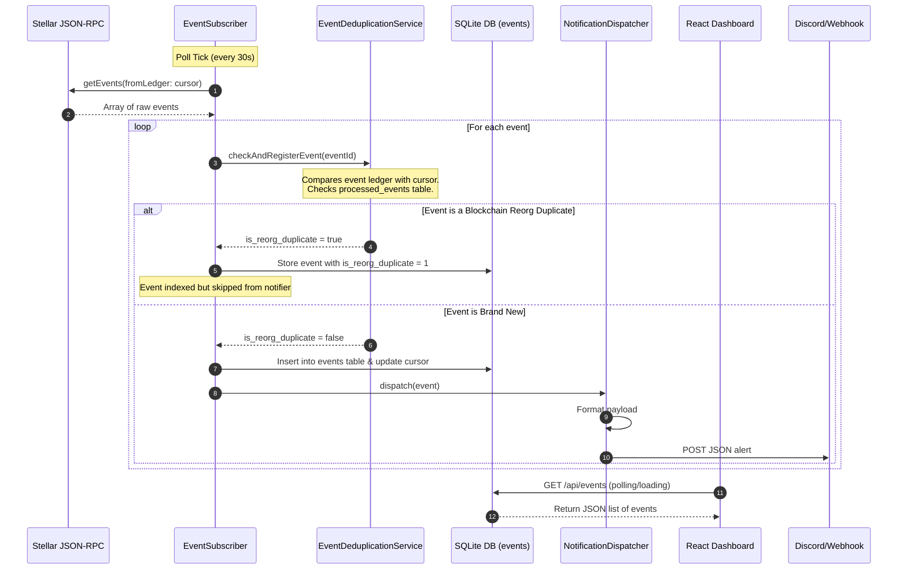
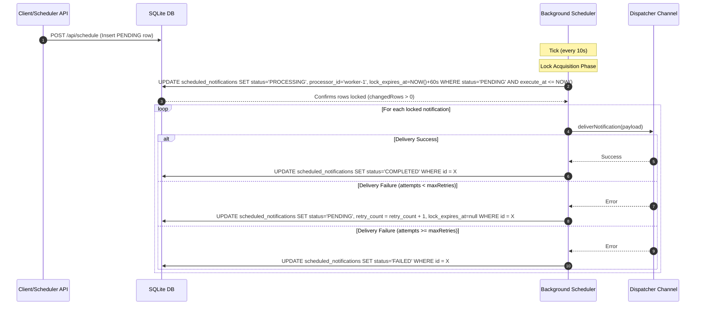

# Contributor Architecture Deep Dive

This guide provides a comprehensive deep dive into the architecture, boundaries, components, data flows, and concurrency models of the NotifyChain platform. It is designed to help new and existing contributors understand how the systems interact without requiring maintainer assistance.

---

## 1. System Boundaries & Tech Stack

NotifyChain is split into three decoupled components, separated by network and transaction boundaries:

```
┌────────────────────────────────────────────────────────────────────────┐
│                        NotifyChain Platform                            │
│                                                                        │
│  [On-Chain Layer]                                                      │
│  ┌───────────────────────┐                                             │
│  │   Soroban Contracts   │                                             │
│  │  (AutoShare/TaskBounty)│                                             │
│  └───────────┬───────────┘                                             │
│              │ emits events (ledger)                                   │
│              ▼                                                         │
│  ┌───────────────────────┐                                             │
│  │    Stellar Network    │                                             │
│  └───────────┬───────────┘                                             │
│              │ polls RPC (JSON-RPC)                                    │
│  ============│======================================================== │ System boundary (On-chain/Off-chain)
│              ▼                                                         │
│  [Off-Chain Layer]                                                     │
│  ┌──────────────────────────────────────────────────┐                  │
│  │                 Listener Service                 │                  │
│  │  ┌─────────────────┐       ┌──────────────────┐  │                  │
│  │  │ EventSubscriber │ ────▶ │ Deduplicator     │  │                  │
│  │  └─────────────────┘       └────────┬─────────┘  │                  │
│  │                                     ▼            │                  │
│  │                            ┌──────────────────┐  │                  │
│  │                            │   SQLite Store   │  │                  │
│  │                            └────────┬─────────┘  │                  │
│  │                                     ▼            │                  │
│  │  ┌─────────────────┐       ┌──────────────────┐  │                  │
│  │  │  REST API Server│       │  Notification    │  │                  │
│  │  │  (Port 8787)    │       │  Dispatcher      │  │                  │
│  │  └────────┬────────┘       └────────┬─────────┘  │                  │
│  └───────────┼─────────────────────────┼────────────┘                  │
│              │ HTTP response           │ push alerts                   │
│  ============│=========================│============================== │ Network boundary
│              ▼                         ▼                               │
│  [Frontend Layer]                [Alert Consumers]                     │
│  ┌───────────────────────┐       ┌──────────────────────┐              │
│  │    React Dashboard    │       │ Discord/Webhook/Slack│              │
│  │     (Vite App)        │       └──────────────────────┘              │
│  └───────────────────────┘                                             │
└────────────────────────────────────────────────────────────────────────┘
```

1. **Smart Contracts (On-Chain)**: Written in Rust for the Soroban smart contract platform. They run in a WebAssembly (WASM) sandbox, mutate ledger state, and emit structured events. Located in [contract/contracts/hello-world](file:///workspaces/Notify-Chain/contract/contracts/hello-world) and [Documents/Task Bounty](file:///workspaces/Notify-Chain/Documents/Task%20Bounty).
2. **Listener Service (Off-Chain Engine)**: Written in Node.js and TypeScript. It polls the Stellar RPC, parses, deduplicates, and stores events in SQLite, and dispatches real-time alerts. Located in [listener](file:///workspaces/Notify-Chain/listener).
3. **React Dashboard (Frontend)**: A standard Vite + React SPA that consumes the REST API exposed by the listener service to display events and schedule performance statistics. Located in [dashboard](file:///workspaces/Notify-Chain/dashboard).

---

## 2. On-Chain Event Design Patterns

NotifyChain supports two smart contract interaction patterns with different design structures:

### 2.1 Struct Event Pattern (AutoShare)
Implemented in [base/events.rs](file:///workspaces/Notify-Chain/contract/contracts/hello-world/src/base/events.rs). The contract defines dedicated struct types decorated with `#[contractevent]`. Each event carries standard routing topics:
- **`NotificationCategory`**: A 4-variant enum mapping events to functional domains (`Group`, `Admin`, `Financial`, `Notification`).
- **`NotificationPriority`**: A 4-variant enum detailing severity (`Low`, `Medium`, `High`, `Critical`).

These are appended as the last two indexed topics to ensure backward compatibility for simpler indexers.

### 2.2 Subject-Action Event Pattern (TaskBounty)
Implemented in [src/events.rs](file:///workspaces/Notify-Chain/Documents/Task%20Bounty/src/events.rs). The contract does not use routing metadata structures. Instead, it emits events as tuples of short symbols matching the `(Subject, Action)` schema:
- E.g., `(symbol_short!("task"), symbol_short!("created"))` or `(symbol_short!("sub"), symbol_short!("approved"))`.
- Payload arguments (like task ID, amount, and creator) are passed as tuples in the event data field.

---

## 3. Off-Chain Event Pipeline & Ingestion

The ingestion process runs inside the off-chain listener service and handles retrieval, deduplication, and indexing.



### 3.1 Step-by-Step Processing Pipeline:
1. **Polling**: The [EventSubscriber](file:///workspaces/Notify-Chain/listener/src/services/event-subscriber.ts) wakes up at configured intervals (default: 30 seconds) and invokes `getEvents` on the Stellar RPC using the last persisted ledger sequence.
2. **Persistent Deduplication**: The [EventDeduplicationService](file:///workspaces/Notify-Chain/listener/src/services/event-deduplication-service.ts) checks each incoming event. It references the `processed_events` SQLite table to see if the event ID has already been indexed.
3. **Reorg Handling**:
   - If the RPC returns an event with a ledger number *lower* than the last processed ledger cursor, the system flags a blockchain reorganization.
   - It sets `is_reorg_duplicate = true` on the event.
   - The event is stored in SQLite for integrity, but the pipeline **skips sending Discord alerts or notifications** to prevent duplicate spam.
4. **In-Memory Cache (LRU)**: A secondary fast-path `NotificationDeduplicator` stores the last 60 seconds of event hashes in memory to prevent database roundtrips for duplicate frames.
5. **Persistence**: The event is formatted and saved to the `events` table. The `polling_cursors` table is updated with the new ledger index.
6. **Dispatch**: The [NotificationDispatcher](file:///workspaces/Notify-Chain/listener/src/services/notification-dispatcher.ts) formats the event and pushes it to active channels (e.g. Discord webhook).

---

## 4. Future-Dated Scheduled Notifications Lifecycle

NotifyChain supports scheduling notifications to be sent in the future. To prevent race conditions in multi-instance deployments (high availability), it implements a strict distributed locking pattern on SQLite.

### 4.1 State Machine
A scheduled notification transitions through the following states:
```
           POST /api/schedule
                 │
                 ▼
         ┌───────────────┐
         │    PENDING    │◀──────────────────┐
         └───────┬───────┘                   │
                 │ poller locks row          │ Stale lock recovery
                 ▼                           │ (after 60s timeout)
         ┌───────────────┐                   │
         │  PROCESSING   │───────────────────┘
         └───────┬───────┘
                 │
         ┌───────┴───────┐
         ▼               ▼
   ┌───────────┐   ┌───────────┐
   │ COMPLETED │   │  FAILED   │  (Retry limit reached)
   └───────────┘   └───────────┘
```

### 4.2 Lock and Delivery Concurrency Model



To coordinate multiple listeners reading the same database file, the scheduler queries the database atomically:

```sql
UPDATE scheduled_notifications
   SET status = 'PROCESSING',
       processor_id = $1,
       lock_expires_at = $2
 WHERE id = $3
   AND status = 'PENDING';
```

Because SQLite executes writes sequentially and locks the database, only one worker instance can change the status of a specific ID. If a worker crashes while processing, a **lock recovery routine** running on the scheduler resets any `PROCESSING` rows whose `lock_expires_at` has passed back to `PENDING`.

---

## 5. Directory and Key Module Map

Here are the critical paths and files that implement the core functionality of NotifyChain:

### 5.1 Smart Contracts
- [contract/contracts/hello-world/src/lib.rs](file:///workspaces/Notify-Chain/contract/contracts/hello-world/src/lib.rs): Entry point for the AutoShare contract. Declares the functions and maps calls to the logic module.
- [autoshare_logic.rs](file:///workspaces/Notify-Chain/contract/contracts/hello-world/src/autoshare_logic.rs): Core business logic for AutoShare groups, members, subscriptions, withdrawals, and scheduled notification parameters.
- [base/events.rs](file:///workspaces/Notify-Chain/contract/contracts/hello-world/src/base/events.rs): Structure definitions for category-priority routed events.
- [Documents/Task Bounty/src/lib.rs](file:///workspaces/Notify-Chain/Documents/Task%20Bounty/src/lib.rs): Entry point for the TaskBounty contract.
- [Documents/Task Bounty/src/events.rs](file:///workspaces/Notify-Chain/Documents/Task%20Bounty/src/events.rs): Emits the unstructured subject-action events for tasks, submissions, and disputes.

### 5.2 Off-Chain Listener Service
- [listener/src/index.ts](file:///workspaces/Notify-Chain/listener/src/index.ts): Initializer script. Bootstraps the HTTP API server, SQLite store, subscriber, and scheduler loops.
- [listener/src/services/event-subscriber.ts](file:///workspaces/Notify-Chain/listener/src/services/event-subscriber.ts): Polls Stellar RPC logs and drives the ingestion loop.
- [listener/src/services/event-deduplication-service.ts](file:///workspaces/Notify-Chain/listener/src/services/event-deduplication-service.ts): SQLite-backed deduplication layer; houses reorg-detection safeguards.
- [listener/src/services/notification-scheduler.ts](file:///workspaces/Notify-Chain/listener/src/services/notification-scheduler.ts): Periodically queries SQLite for due scheduled notifications, acquires locks, dispatches alerts, and performs recovery.
- [listener/src/store/](file:///workspaces/Notify-Chain/listener/src/store/): Holds the repositories (`EventRepository`, `ScheduleRepository`) managing queries to SQLite.

### 5.3 Frontend Dashboard
- [dashboard/src/pages/](file:///workspaces/Notify-Chain/dashboard/src/pages/): Contains top-level dashboard pages: `Events` (real-time stream), `Schedules` (notification queue stats), and `Stats` (overview charts).
- [dashboard/src/hooks/](file:///workspaces/Notify-Chain/dashboard/src/hooks/): React hooks for fetching event feeds, managing poll intervals, and querying status counts from the listener.
